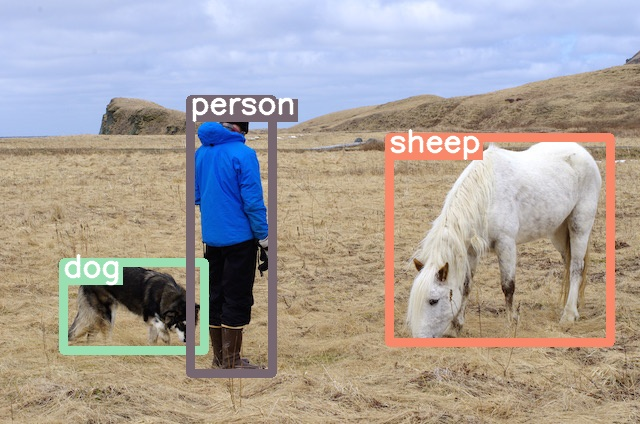
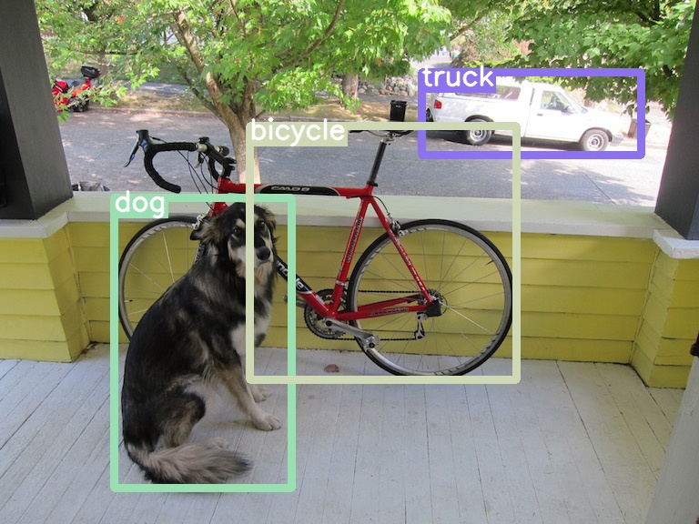

# :construction: Work in Progress :construction:

# M2Det

This is an implementation of M2Det with TensorFlow.
M2Det is proposed by Q Zhao in 
[M2Det: A Single-Shot Object Detector based on Multi-Level Feature Pyramid Network](
https://arxiv.org/pdf/1811.04533.pdf).

## Results

COCO 2017 dataset is used for training.





Not so good...

## Performance

To be released.


## Usage

### Requirements

- Python 3.6
- TensorFlow 1.8

### Model

You can download the trained model [[link](https://www.dropbox.com/s/f60stlms3dp7slu/weights_2019-01-14.tar.gz?dl=0)].

:warning: Notice: it's work in progress and the performance is not so good.

### Run Demo

```
$ python demo.py --inputs <image_path> --model_path <model_path>
```

### How to Train

#### I. Prepare dataset

Download COCO (2017) dataset from [http://cocodataset.org](http://cocodataset.org) 
and process them:

```
$ python mscoco/process.py \
--image_dir <image_dir> \
--annotation_path <annotation_dir> \
--output_dir <output_dir>
```

#### II. Download pretrained model

```
$ cd weights/
$ bash download.sh
```

#### III. Train model

```
$ python train.py --image_dir <image_dir> --label_dir <label_dir>
```
